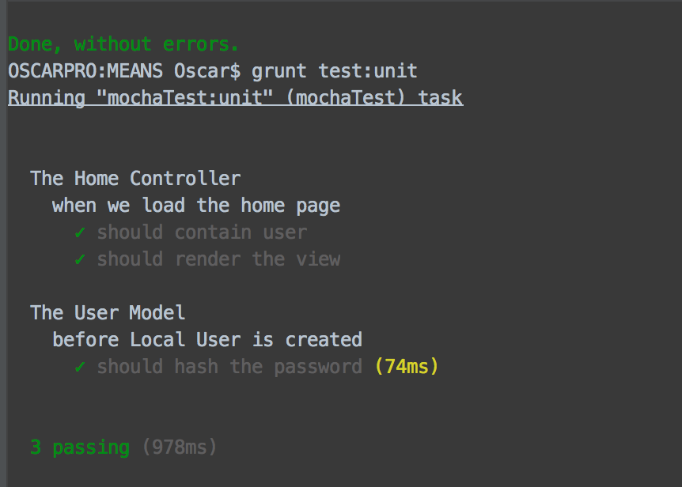
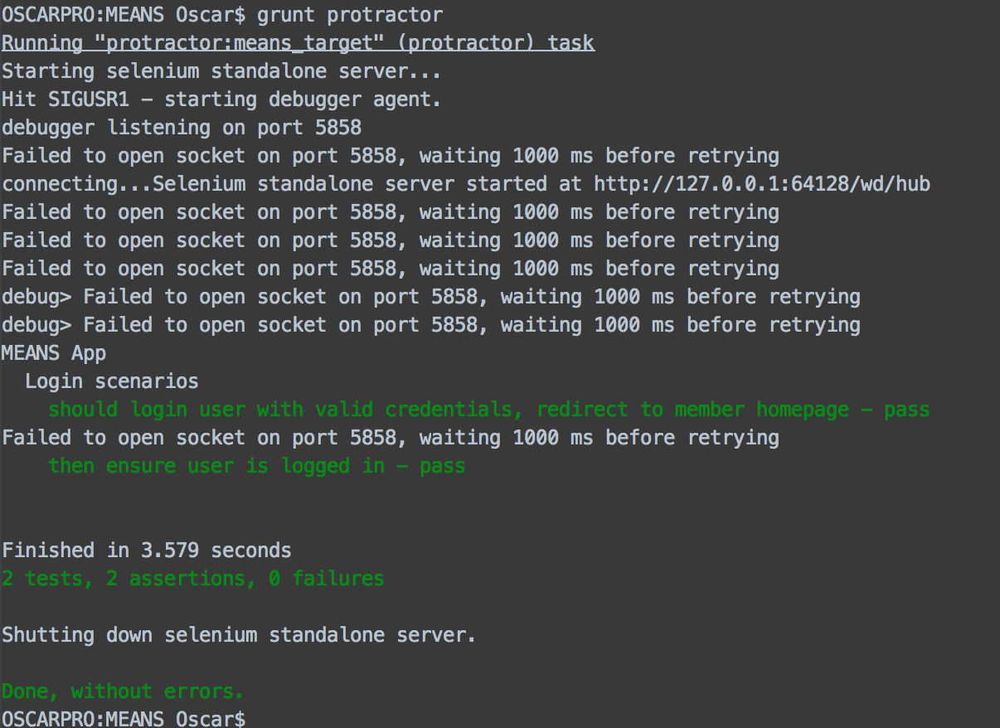
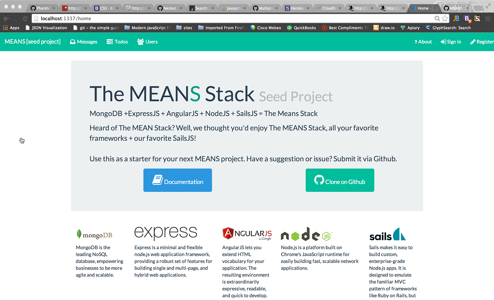

# MEANS #


MEANS is a boilerplate seed project that gives you a great foundation to start building real-time MongoDB + ExpressJS + AngularJS + SailsJS, single page applications.  It uses all the features available in the SailsJS framework and follows the same folder structure.

SailsJS was created by [Mike McNeil](https://twitter.com/mikermcneil) and has gracefully open sourced it.  You can view documentation at [http://sailsjs.org](http://sailsjs.org)

We've created a sample **TODO** module. Go ahead and sign in with a couple different users in multiple browsers to see how it all works.

<br/>

[](https://travis-ci.org/SharePointOscar/MEANS)

# Getting Started #

## Prerequisites ##
Before you begin, you should make sure you have installed all these prerequisites on your development machine.

####Node.js & npm#####
Download & Install Node.js and the npm package manager, if you encounter any problems, you can also use this Github Gist to install Node.js.

######MongoDB####
Download & Install MongoDB, and make sure it's running on the default port (27017).

####Bower####
You're going to use the Bower Package Manager to manage your front-end packages, in order to install it make sure you've installed Node.js and npm, then install bower globally using npm:
	
	$ npm install -g bower

####Grunt####
You're going to use the Grunt Task Runner to automate your development process, in order to install it make sure you've installed Node.js and npm, then install grunt globally using npm:

	$ npm install -g grunt-cli
Note: Your user might not have the permissions to install package globally, so use a super user or sudo or run with admin provledges for windows command


Ensure you have **Sails v0.10** installed on your machine by executing the following commands:

    $ sudo npm install sails -g
    

This will install the CLI globally.  Once you have the Sails CLI installed, proceed to execute the following:

    
    $ git clone https://github.com/SharePointOscar/MEANS.git
    $ cd into repo folder
    $ npm install
    $ bower install

This will install all client and server side packages needed.  Upon succesfully running the commands above, you are ready to lift your app!  At the root of the project run the following

    $ sails lift

View the app on your local machine at [http://localhost:1337](http://localhost:1337)  


#Folder Structure #

```

├── api 								-- server-side 
│   ├── controllers 
│   ├── models 
│   ├── policies 
│   ├── responses 
│   └── services 
├── assets							-- client-side 
│   ├── bower_components 
│   ├── fonts 
│   ├── images 
│   ├── src							-- AngularJS components 
├   	|── app 
		|-- common 
		  |-- directives 
		  ├── models 
		  ├── services 
│   └── styles 
├── config							-- SailsJS Configuration 
│   
 ├── node_modules 
│   
├── tasks							    -- Grunt Tasks 
│   ├── config 
│   └── register 
├── tests								 -- Testing Scripts 
│   ├── e2e 
		  |-- controllers 
│   └── unit
		  |-- adapters 
		  ├── controllers 
		  ├── models   		
 		  ├── policies 
		  ├── services 							
   ├── views 
│   ├── auth 
│   ├── home 
│   └── layouts 

	
```

# Built-in Features #

## Authentication ##
The project uses the solid [PassportJS](http://passportjs.org) authentication module, which supports Local(username/password) and OAuth for Facebook, Twitter, Github etc.  Adding providers is as easy as modifying the config/passport.js and specifying your provider information.  

<br/>

## Branding ##
MEANS comes with [Bootswatch Themes](http://bootswatch.com/) created by [Thomas park](http://thomaspark.me/) to change the Theme, simply modify the *assets/styles/importer.less* file.  We also included [Font Awesome](http://fortawesome.github.io/Font-Awesome/)  

<br/>

## Asset Management ##
MEANS asset pipeline is streamlined, including additional AngularJS or other frameworks and libraries is as easy as modifying the file located at *tasks/pipeline.js*

<br/>

## Grunt ##
Grunt is included with various tasks including concat, minifying, less compiling and uglify, but it is not required.  For more detail, view tasks/README.md  

<br/>

## Support for Multiple Layouts ##
It is typical for a website that has membership to have different Layouts than the public section.  Because of this, we've demonstrated how you can use a public layout for non-members and a private layout for members.

<br/>

## Internationalization using i18n ##
SailsJS comes multi-language support, and so we've configured it and show this on the home page of the project.

<br/>

## Unit and e2e Testing (Client-side and Server-side) ##
We've integrated Grunt Tasks for MochaJS unit testing.  We've created two tests, a **server-side Controller Unit Test** and a **server-side Model Unit Test**, all successful.

#### MochaJS Unit Testing ####
Just use the following command for MochaJS Unit Testing

	$ grunt test:unit 


The result of executing this command is shown below.  




#### Protractor e2e Testing ####
Just use the following command for E2E  Testing

	$ grunt protractor

The result of executing this command is shown below. 



<br/>


## Screenshots ##



<br><br><br>

# Authors
[@SharePointOscar](http://twitter.com/SharePointOscar) and [@jrtgtz](http://twitter.com/SharePointOscar)

<br>
# Roadmap
 - Document deployment to various clouds such a [Heroku](http://www.heroku.com), [Cloudbees](http://www.cloudbees.com) and others.
 - Add additional test script for both client-side and server-side


<br>
# Contributing
All contributions are welcome.  For any feature, you should include a test script and ensure all tests are passing.

Please submit Issues via [Github](https://github.com/SharePointOscar/MEANS/issues)
<br>

# Thanks
This application wouldn't be possible to do if I didn't get some help and support from others. So special thanks goes to people on list below.

The entire team at [sailsjs.org](http://sailsjs.org), [AngularSails](https://github.com/janpantel/angular-sails) and [Sailng - for starting the fire](https://github.com/ryancp/sailng)

